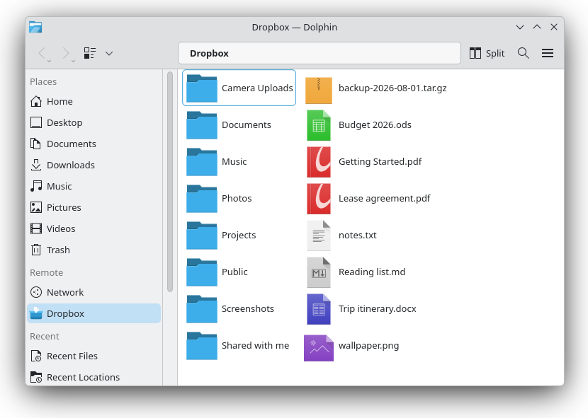

# kio-dropbox

[](https://github.com/timpalpant/kio-dropbox/actions/workflows/ci.yml)
[](https://github.com/timpalpant/kio-dropbox/releases)
[](LICENSE)

A [KIO worker](https://develop.kde.org/docs/features/kio/) that makes a Dropbox
account browsable as `dropbox:/` in Dolphin and every other KDE application.

There is no proprietary Dropbox client involved and nothing is synced to disk —
this talks to the Dropbox HTTP API directly, so folders are listed on demand and
files are streamed as they are opened.

**Website:** <https://timpalpant.github.io/kio-dropbox/>

> kio-dropbox is an independent project. It is not affiliated with, endorsed by,
> or sponsored by Dropbox, Inc. "Dropbox" is a trademark of Dropbox, Inc.,
> referred to here only to describe the service this software interoperates
> with.

## Screenshots

<p align="center">
  
</p>

## Installing

Every release ships Arch, Debian and RPM packages — see
[releases](https://github.com/timpalpant/kio-dropbox/releases):

```sh
sudo pacman -U kio-dropbox-*.pkg.tar.zst     # Arch
sudo apt install ./kio-dropbox_*.deb         # Debian / Ubuntu
sudo dnf install ./kio-dropbox-*.rpm         # Fedora
```

There is no Flatpak, and cannot usefully be one: a KIO worker is only visible to
applications that can load it, and a Flatpak's plugins live inside its own
sandbox, so the host's Dolphin would never see `dropbox:/`.

Log out and back in after installing, then link an account in **System
Settings → Network → Settings → Dropbox**. To build from source instead, see
[Building](#building).

## Status

Every operation below is covered by an integration test that drives the real,
built worker through `kioclient` against a local stand-in for the Dropbox API
(see [Testing](#testing)) — listing with pagination, streaming reads, chunked
uploads, server-side move and copy, recursive delete, overwrite semantics,
access-token refresh and HTTP 429 backoff. The same suite checks that the
sidebar entry is added and removed correctly and that System Settings discovers
the configuration module.

Two things that suite cannot cover, and which are therefore still unverified:

- **Real Dropbox servers.** The fake implements the API as documented; only an
  account can confirm the documentation matches reality. This is the first thing
  to try after installing.
- **Free-space reporting**, which no command-line client exercises. It shows up
  in Dolphin's status bar.

## Features

| Operation | Supported | Notes |
| --- | --- | --- |
| Browse folders | yes | paginated, so large folders stream in |
| Read files | yes | streamed, with progress |
| Write files | yes | uploads over 8 MiB use chunked upload sessions |
| Create folders | yes | |
| Delete | yes | recursive, via Dropbox's own recursive delete |
| Rename / move | yes | server-side, no data transfer |
| Copy within Dropbox | yes | server-side, no data transfer |
| Copy to/from local | yes | via KIO's generic streaming fallback |
| Free space | yes | shown in Dolphin's status bar |
| Sidebar entry | yes | under **Remote**, toggleable |
| System Settings page | yes | Network → Settings → Dropbox |
| Shared links, revisions, Paper | no | |

Known limitations:

- One account at a time. Linking a second account replaces the first.
- No file locking or conflict detection beyond what Dropbox itself enforces.
- Modification times are read-only: Dropbox sets them at upload.
- Thumbnails come from KIO's generic remote previews (Dolphin must have
  "Show previews for remote files" enabled), not Dropbox's thumbnail endpoint.

## Building

Dependencies: Qt 6 (Core, Network, Gui, Widgets) and KDE Frameworks 6 (KIO,
CoreAddons, I18n, Wallet, WidgetsAddons, ConfigWidgets, KCMUtils). On
Arch/EndeavourOS these come from `qt6-base`, `kio`, `kwallet` and `kcmutils`,
all of which a Plasma desktop already has. Notably *not* required is
`extra-cmake-modules`, since the individual KF6 config files are self-contained.

```sh
cmake -S . -B build -DCMAKE_INSTALL_PREFIX=/usr
cmake --build build -j$(nproc)
sudo cmake --install build
```

That installs three things:

| | |
| --- | --- |
| `…/qt6/plugins/kf6/kio/dropbox.so` | the worker |
| `…/qt6/plugins/plasma/kcms/systemsettings_qwidgets/kcm_dropbox.so` | the System Settings page |
| `…/bin/kio-dropbox-auth` | the standalone setup window |

All of them have to live somewhere Qt's plugin loader looks, which is why the
default prefix is `/usr`. To install without root, pick a prefix and point Qt at
it — but note that this must be set for the whole desktop session, not just one
shell, or Dolphin and System Settings won't see them:

```sh
cmake --install build --prefix ~/.local
# then, in ~/.config/plasma-workspace/env/kio-dropbox.sh:
export QT_PLUGIN_PATH="$HOME/.local/lib/qt6/plugins:$QT_PLUGIN_PATH"
```

Log out and back in after installing, so running applications pick up the new
protocol and the new settings page.

## Linking an account

Configure it in **System Settings → Network → Settings → Dropbox**, or run the
same thing as a standalone window:

```sh
kio-dropbox-auth
```

If the build was configured with `-DDROPBOX_APP_KEY=…`, this is one click:
**Connect to Dropbox**, approve the request, paste the code back.

Otherwise you register a Dropbox app of your own first. Follow the steps the
page shows:

1. Create an app at <https://www.dropbox.com/developers/apps/create> — choose
   **Scoped access**, then **Full Dropbox**, and any name you like.
2. On the app's **Permissions** tab, tick `files.metadata.read`,
   `files.content.read`, `files.content.write` and `account_info.read`, then
   **Submit**. (Do this before authorizing; Dropbox grants scopes at
   authorization time, and changing them afterwards means re-authorizing.)
3. Paste the **App key** from the Settings tab, click **Authorize in Browser**,
   approve the request, and paste the code Dropbox shows back into the dialog.

The OAuth exchange uses PKCE with no redirect URI, so there is nothing to
configure on the Dropbox side and no local web server involved.

Linking adds **Dropbox** to Dolphin's sidebar, under **Remote**. Already-running
Dolphin windows pick it up without a restart. Untick **Show Dropbox in the file
manager sidebar** to take it back out — that checkbox has no separate stored
setting; whether the sidebar entry exists *is* the setting. It can also be
driven from a script:

```sh
kio-dropbox-auth --sidebar show
kio-dropbox-auth --sidebar hide
kio-dropbox-auth --status
```

You can also reach Dropbox by typing `dropbox:/` into the location bar, or from
**Network** in Dolphin.

If no account is linked when you open `dropbox:/`, the worker offers to launch
the setup window for you.

### Where credentials are stored

| What | Where |
| --- | --- |
| Refresh token (long-lived secret) | KWallet, folder `kio-dropbox` |
| App key, account name/email | `~/.config/kio-dropboxrc` |
| Access token (4 h) | `$XDG_RUNTIME_DIR/kio-dropbox-token.json`, mode 0600 |

If KWallet is unavailable — a headless box, or a session without a wallet — the
refresh token falls back to `~/.config/kio-dropbox/refresh-token` with mode
0600, and the setup dialog warns you that it did. Set `KIO_DROPBOX_NO_WALLET=1`
to skip the wallet deliberately.

To unlink, run `kio-dropbox-auth` and click **Unlink This Account**. Revoke the
app itself from <https://www.dropbox.com/account/connected_apps>.

## Testing

`tests/fake_dropbox.py` implements enough of the Dropbox v2 API to drive the
worker — including its error shapes, `list_folder` pagination, chunked upload
sessions, token expiry and HTTP 429 — and `tests/run_tests.sh` drives the real,
built worker against it through `kioclient`:

```sh
tests/run_tests.sh build
```

This works because the API roots are overridable via `KIO_DROPBOX_API_BASE`,
`KIO_DROPBOX_CONTENT_BASE` and `KIO_DROPBOX_TOKEN_ENDPOINT`. Those exist for the
test suite; there is no reason to set them in normal use.

## Debugging

KIO workers log through Qt's categorized logging:

```sh
QT_LOGGING_RULES='kf.kio.*=true' dolphin dropbox:/
```

To watch a single operation without Dolphin in the way, use `kioclient`:

```sh
kioclient ls dropbox:/
kioclient cat dropbox:/some/file.txt
```

## License

GPL-2.0-or-later. See [LICENSE](LICENSE).
